#####################
SLAC Grafana Overview
#####################

Operations and procedures for Grafana at the USDF.

This document describes how Grafana is deployed and operated, including
its components, data sources, and alerting configuration.

Architecture and Dependencies
=============================

Architecture Diagram
--------------------

Grafana Deployment
------------------

* **Grafana version:** 13.1.2 (Grafana OSS).
* **Topology:** deployed in **High Availability** mode with **horizontal
  autoscaling** — multiple Grafana replicas run behind a Kubernetes
  Service, and the replica count is adjusted automatically based on
  load.
* **Alerting coordination:** the Grafana replicas form a cluster using
  the built-in **gossip protocol** (memberlist). This is what prevents
  duplicate alert notifications: when an alert fires, only one replica
  is elected to deliver the notification, while the others acknowledge
  it via the gossip layer.

.. note::

   Without the gossip protocol, each HA replica would independently
   evaluate the same alert rule and send its own Slack message,
   producing N duplicate notifications for N replicas. Keep the
   memberlist ports open between Grafana pods; failures in gossip
   convergence are the most common cause of duplicated alerts.

Components and Roles
--------------------
Grafana Server
~~~~~~~~~~~~~~
Provides the UI, dashboards, and alerting engine.

Data Sources
~~~~~~~~~~~~

* **InfluxDB** — Telegraf metrics (internal metrics from all the s3df servers) and Slurm metrics. Retention forever. Supported by S3DF

* **Prometheus** — Kubernetes metrics. Retention 1 year. Supported by S3DF

* **Loki** — additional log aggregation. Using promtail that tail logs and push it to s3. Retention forever. Supported by S3DF

* **Thanos** - New TSDB commisioned as long term solution for Prometheus. Retention forever. Supported by S3DF

* **OpenSearch** — :doc:`../usdf-applications/drp/opensearch/index` TSDB application exclusive datasource used by Rubin. Not supported by S3DF

.. note::

   Application-specific TSDBs that are **not** suported by S3DF are still
   supported at the alerting layer — we only configure their contact
   points in Grafana.

Alerting Engine
~~~~~~~~~~~~~~~

* Contact Points
* Notification Policies
* Alert Templates

Internal Dependencies
---------------------

Configuration Storage
~~~~~~~~~~~~~~~~~~~~~

Grafana persists all of its configuration (dashboards, users, folders,
data source definitions, alert rules, contact points, notification
policies, and templates) in an internal PostgreSQL database managed by
`CloudNativePG <https://cloudnative-pg.io/>`_.

* **Cluster name:** ``cnpg-grafana``
* **Namespace:** ``monitoring-system``
* **Topology:** one primary plus two replicas (HA).

.. warning::

   The Grafana database is the single source of truth for all Grafana
   configuration. Losing it means losing every dashboard, alert rule,
   contact point, and notification policy. Backups are handled by the
   same CNPG / Barman Cloud mechanism.

Infrastructure
~~~~~~~~~~~~~~

* Kubernetes ``Service`` fronting the Grafana pods in
  ``monitoring-system``.
* CNPG-managed PostgreSQL cluster ``cnpg-grafana`` (pods
  ``grafana-db-1``, ``grafana-db-2``, ``grafana-db-3``) as the Grafana
  backing store.

External Dependencies
---------------------

* **Slack API** — used for alert delivery.

Upstream and Downstream Services
--------------------------------

Upstream
~~~~~~~~

* Telegraf plugin running on each server collecting metrics using different plugins (InfluxDB metrics).
* Prometheus scrapers. Prometheus passthrough must be enabled on vcluster to expose prometheus metrics
* Promtail pushing logs. Containers must stdout/stderror information in order that promtail tail the logs

Downstream
~~~~~~~~~~

* Slack notification channels.
* Grafana dashboards consumed by users.

Data Flow
---------

#. TSDB ingest (Telegraf|Slurm → InfluxDB Storage)
#. TSDB Prometheus scrapes → Prometheus Storage.
#. Promtail → tail logs stored on each system under ``/var/log/.*`` → Loki
#. Grafana queries the data sources through the datasource connections.
#. Dashboards and alert rules evaluate the returned time series.
#. Firing alerts are routed to Contact Points by Notification Policies.
#. The gossip-coordinated Grafana cluster elects a single replica to
   send each notification.
#. Slack or email notifications are delivered.

Configuration Details
=====================
To properly show a human readable text of the time-series of the alert S3DF created
a template that automatically will be populated.

Template
---------

Template used in ``ops-usdf-alerts``
~~~~~~~~~~~~~~~~~~~~~~~~~~~~~~~~~~~~

.. code-block:: go

   {{ define "titleslack_empty" }}{{ end }}
   {{ define "messageslack_single_fs" }}
     {{ if gt (len .Alerts.Firing) 0 }}
       {{ template "text_alert_list_firing_f" .Alerts.Firing }}
     {{ end }}
     {{ if gt (len .Alerts.Resolved) 0 }}
       {{ template "text_alert_list_resolved_r" .Alerts.Resolved }}
     {{ end }}
   {{ end }}
   {{ define "text_alert_list_firing_f" }}
     {{ range . }}
       <{{ .PanelURL }}|:warning:> {{ .Annotations.description }}
     {{ end }}
   {{ end }}

   {{ define "text_alert_list_resolved_r" }}
     {{ range . }}
       <{{ .PanelURL }}|:white_check_mark:> {{ .Annotations.descriptionresolved }}
     {{ end }}
   {{ end }}

How Alerts Are Routed
=====================

When an alert fires:

#. The alert includes a set of **labels** (for example,``facility=Rubin``).
#. Grafana evaluates the Notification Policies and finds the policy that matches those labels.
#. The matching policy sends the alert to the corresponding Contact Point.

**Example**

* An alert carries the label ``facility=Rubin``.
* A Notification Policy states: *"If ``facility = Rubin``, send to Contact Point ``ops-usdf-alerts-slack``."*
* Result: the alert is delivered to the Rubin Observatory ``#ops-usdf-alerts`` Slack channel.

Labels are the **keys used for routing**. If a Notification Policy is
looking for ``facility=s3df``, the alert must carry that label for the
rule to match.

Labels let you:

* Send different alerts to different Slack channels.
* Separate alerts by team or system.
* Control delivery based on alert type or severity.