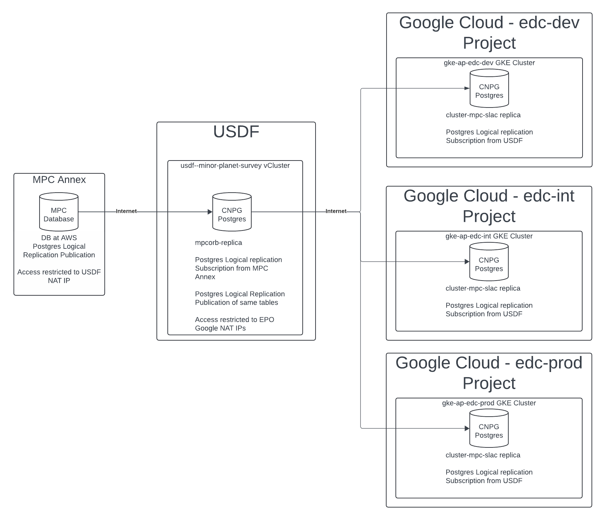

####################
Database Information
####################

The following sections provide detail on the Minor Planet Survey Replica.

Architecture
============
.. Describe the architecture of the application including key components (e.g API servers, databases, messaging components and their roles).  Describe relevant network configuration.

The ``mpcorb`` Postgres database is installed in the ``usdf-minor-planet-survey`` Kubernetes vCluster in the ``mpcorb-replica`` namespace with the Cloud Native Postgres Operator.  Some of the data comes from Rubin, but is sent to the MPC Annex first via HTTP, loaded into the database, then replicated back to Rubin.

Postgres Logical Replication is used to replicate data from the MPC annex to the USDF. ``mpcorb`` depends on Internet connectivity to receive updates from the MPC Annex.  The SLAC NAT IP was shared with the MPC Annex as the NAT addresses used for outbound connectivity with SLAC.  If this address changes the MPC Annex will need to be notified.

``mpcorb`` is also setup as a Postgres publication to replicate data to the EPO.  Further details are in the Architecture Diagram and Data Flow sections of this page.

The largest table is ``obs_sbn``.

Architecture Diagram
====================
.. Include architecture diagram of the application either as a mermaid chart or a picture of the diagram.

Associated Systems
==================
.. Describe other applications are associated with this applications.

Configuration Location
======================
.. Detail where the configuration is stored.  This is typically in GitHub, Kubernetes Configuration Maps, and/or Vault Secrets.

`here <https://github.com/slaclab/rubin-usdf-minor-planet-survey/tree/main/kubernetes/overlays/prod/sql>`__

.. list-table::
   :widths: 25 25
   :header-rows: 1

   * - Config Area
     - Location
   * - Kubernetes Configuration
     - https://github.com/slaclab/rubin-usdf-minor-planet-survey/tree/main/kubernetes/overlays/prod
   * - SQL Configuration
     - https://github.com/slaclab/rubin-usdf-minor-planet-survey/tree/main/kubernetes/overlays/prod/sql
   * - Vault Secrets Dev
     - secret/rubin/usdf-minor-planet-survey/postgres
   * - Vault Secrets Prod
     - N/A

Data Flow
=========
.. Describe how data flows through the system including upstream and downstream services

The Minor Planet Center Annex is the Postgres Logical Replica publication.  The USDF Minor Planet Center replica is configured with subscription to the Obs table and to the other tables at the Annex.

Rubin EPO also needs a copy of this data.  It was not an option to connect directly from EPO to the Minor Planet Center Annex so a double hop Postgres Replication is setup.  The USDF Minor Planet Center replica is also setup as a Postgres publication to replicate the same tables that it subscribes to.  EPO has a development, integration, and production environments setup as subscriptions in the Google Cloud with the Cloud Native Postgres (CNPG) Operator.  Currently only dev is connected.

Dependencies - S3DF
===================
.. Dependencies at USDF include Ceph, Weka Storage, Butler Database, LDAP, other Rubin applications, etc..  This can be none.

Below are S3DF Dependencies.

* Kubernetes
* SLAC LDAP to authenticate to the vCluster
* DNS resolution for the SBN address
* Weka storage for Kubernetes.  The database uses a persistent volume claim.

Dependencies - External
=======================
.. Dependencies on systems external to S3DF including in US DAC, France or UK DF, or other external systems.  This can be none.

Below are External Dependencies.

* Internet connectivity to receive logical replication updates.  Access is tied to the SLAC NAT IP.

Disaster Recovery
=================
.. RTO/RPO expectations for application.

The sync for the ``sbn146_rubin_usdf_obs_table_sub`` took seven hours and forty minutes when the table size was 234 GB.  There is one replication slot from the Minor Planet Center Annex.
