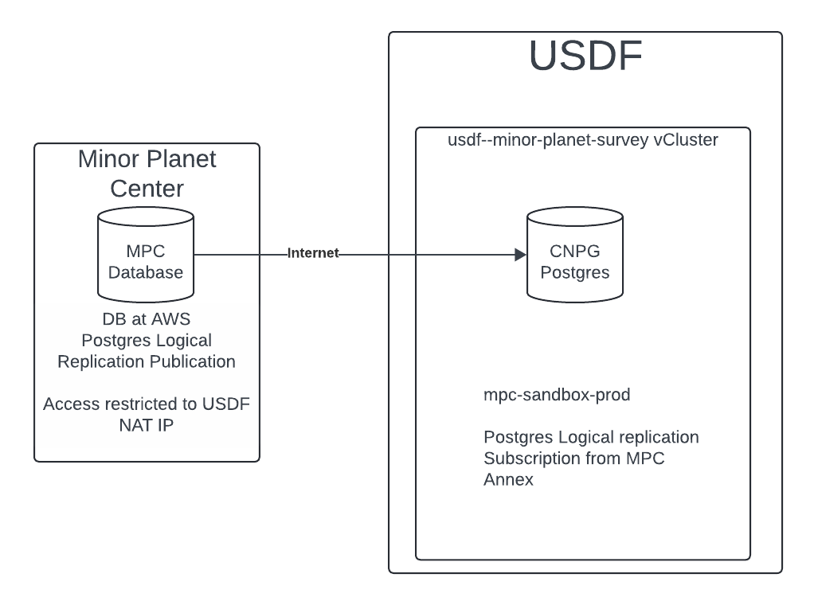

####################
Database Information
####################

The following sections provide detail on the MPC Sandbox.

Architecture
============
.. Describe the architecture of the application including key components (e.g API servers, databases, messaging components and their roles).  Describe relevant network configuration.

The ``mpc-sandbox`` depends on Internet connectivity to receive updates from the MPC.  The SLAC NAT IP was shared with the MPC Annex as the NAT addresses used for outbound connectivity with SLAC.  If this address changes the MPC Annex will need to be notified.

Architecture Diagram
====================
.. Include architecture diagram of the application either as a mermaid chart or a picture of the diagram.

Associated Systems
==================
.. Describe other applications are associated with this applications.

Configuration Location
======================
.. Detail where the configuration is stored.  This is typically in GitHub, Kubernetes Configuration Maps, and/or Vault Secrets.

.. list-table::
   :widths: 25 25
   :header-rows: 1

   * - Config Area
     - Location
   * - Kubernetes Configuration
     - https://github.com/slaclab/rubin-usdf-minor-planet-survey/tree/main/kubernetes/overlays/mpc-sandbox-prod
   * - SQL Configuration
     - https://github.com/slaclab/rubin-usdf-minor-planet-survey/tree/main/kubernetes/overlays/mpc-sandbox-prod/sql
   * - Vault Secrets Dev
     - N/A
   * - Vault Secrets Prod
     - secret/rubin/usdf-minor-planet-survey/postgres-mpc-sandbox

Data Flow
=========
.. Describe how data flows through the system including upstream and downstream services

The Minor Planet Center is the Postgres Logical Replication publication.  The USDF MPC sandbox is the Postgres Logical Replication Subscription.  Connections are initiated outbound to the Minor Planet Center for ongoing replication.  There is no external address defined on the MPC sandbox.  The SLAC NAT IP address was shared with the Minor Planet Center.

Dependencies - S3DF
===================
.. Dependencies at USDF include Ceph, Weka Storage, Butler Database, LDAP, other Rubin applications, etc..  This can be none.

  * Kubernetes
  * SLAC LDAP to authenticate to the vCluster
  * Internet connectivity to receive logical replication updates.  Access is tied to the SLAC NAT IP.
  * DNS resolution for the SBN address
  * Weka storage for Kubernetes.  The database uses a persistent volume claim.

Dependencies - External
=======================
.. Dependencies on systems external to S3DF including in US DAC, France or UK DF, or other external systems.  This can be none.

Disaster Recovery
=================
.. RTO/RPO expectations for application.
