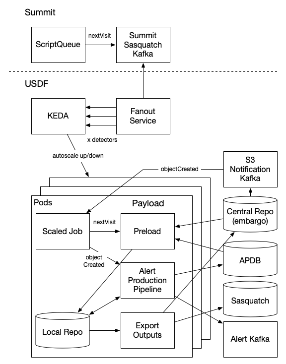

###################
Service Information
###################

Prompt Processing service information.

.. _prompt_processing_architecture:

Architecture
============
.. Describe the architecture of the application including key components (e.g API servers, databases, messaging components and their roles).  Describe relevant network configuration.

Prompt Processing is deployed with Kubernetes Event-driven Autoscaling (KEDA) scaled jobs.  A KEDA Scaled Job is created for each instrument.  In production there is an instances for LSSTCam.  Production runs on Embargo Nodes in Kubernetes.  In development there are instances for LSSTCAM, LATISS, and HSC.  The following paragraphs discuss the architecture and data flow for LSSTCam.

Next Visit events are produced on the Summit Sasquatch Kafka cluster.  The Next Visit Fan Out application connects to Summit Sasquatch with a Kafka consumer to read these events.  A socat proxy is installed in the ``kafka-proxy`` namespace in the Prompt Processing vCluster to proxy connections to the Summit.  Traffic is routed to socat with DNS entries in a config map in the ``kube-system`` namespace that resolve connections to the Summit Sasquatch Kafka Cluster external bootstrap and broker addresses to the socat proxy services for the bootstrap and each broker.  The Next Visit Fan Out application fans out events to the ``instrument:lsstcam`` Redis Stream for each active CCD/detector on LSSTCam.

Next Visit Events are made available at least 20 seconds in advance of the first exposure for a visit.  This allows for some time to scale up resources before images arrive.  KEDA is used to address this requirement of scaling up Prompt Processing prior to when images arrive.  KEDA can scale either Kubernetes Deployments or Jobs.  KEDA Scaled Jobs are used with Prompt Processing because each instance of image processing needs to finish to completion.  Scaled Deployments would have issues with KEDA scaling down resources before processing finished.

The KEDA ``eager`` Scaling strategy is configured in conjunction with the Redis Stream Scaler to scale up Jobs up to the ``maxReplicaCount`` as there are pending Redis Stream messages that have not been consumed by a Scaled Job.  KEDA has visibility into Redis Stream events through a connection configured in the LSSTCam Scaled Job that connects to the the ``instrument:lsstcam`` Redis Stream with the ``lsstcam_consumer_group``.  KEDA reads the number of pending messages in the consumer group.  The ``pendingEntriesCount`` setting is set to ``1`` to scale up Jobs when there is one or more events pending.  This allows for Scaled Jobs to be created before images arrive.

LSSTCam Prompt Processing is configured to listen in a while loop for events in the ``instrument:lsstcam`` Redis Stream with the ``lsstcam_consumer_group``.   As part of preload Prompt Processing connects to a read only replica of Butler Embargo to load a local Butler.  Connections are made to the Presence microservice and S3 File Notifications Kafka Cluster and the to identify when images arrive.  The Presence microservice identifies files that have already arrived by the time the Scaled Job pod starts.  The file notifications from S3 identify files that arrive after the Scaled Jod pod starts.   The processing outputs are sent as a Kafka event to the Prompt Kafka cluster.  The Butler Writer service consumes these Kafka events and writes to Butler.  Alerts are sent to Alert Stream Broker as Kafka events.

Once image processing is finished each Scaled Job will listen for another Redis Stream event.  A timeout is configured so that if no messages arrive before the timeout the Scaled Job is terminated.  This allows for more efficient processing because Jobs and new pods do not need to be created for each event while also allowing Jobs to be scaled down.

.. _prompt_processing_architecture_diagram:

Architecture Diagram
====================
.. Include architecture diagram of the application either as a mermaid chart or a picture of the diagram.

.. _prompt_processing_associated_systems:

Associated Systems
==================
.. Describe other applications are associated with this applications.

See the `Phalanx Prompt ArgoCD Project for related applications <https://phalanx.lsst.io/applications/prompt.html>`__

* Next Visit Fan Out
* Prompt Redis
* Prompt Kafka
* Prompt Keda
* Alert Stream Broker

Configuration Location
======================
.. Detail where the configuration is stored.  This is typically in GitHub, Kubernetes Configuration Maps, and/or Vault Secrets.

.. list-table::
   :widths: 25 25
   :header-rows: 1

   * - Config Area
     - Location
   * - Configuration LSSTCam
     - https://github.com/lsst-sqre/phalanx/tree/main/applications/prompt-keda-lsstcam
   * - Vault Secrets Dev
     - secret/rubin/usdf-prompt-processing-dev/prompt-processing
   * - Vault Secrets Prod
     - secret/rubin/usdf-prompt-processing/prompt-processing

.. _prompt_processing_data_flow:

Data Flow
=========
.. Describe how data flows through the system including upstream and downstream services

Fanned Out events come from the Summit.

Dependencies - S3DF
===================
.. Dependencies at USDF include Ceph, Weka Storage, Butler Database, LDAP, other Rubin applications, etc..  This can be none.

Below are the S3DF Dependencies for the Prompt Processing.
 * Kubernetes
 * SLAC LDAP to authenticate to vCluster
 * LHN connectivity to the Summit for Next Visit Fan Out
 * Next Visit Fan Out
 * Prompt Kafka
 * Prompt Keda
 * Prompt Redis
 * mpsky
 * Auto Ingest Service
 * rubin-summit Ceph bucket
 * Embargo Butler
 * ``/sdf/data/rubin/templates/`` storage
 * Cassandra Cluster
 * Alert Stream Broker
 * Sattle

Dependencies - External
=======================
.. Dependencies on systems external to S3DF including in US DAC, France or UK DF, or other external systems.  This can be none.

Below are external dependencies.
 * Internet access to send alerts

Disaster Recovery
=================
.. RTO/RPO expectations for application.
