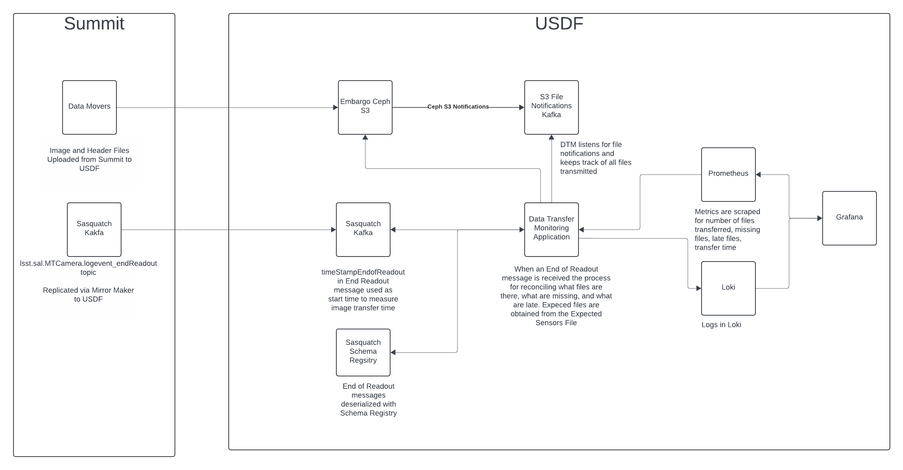

###################
Service Information
###################

.. _DTM_Architecture:

Architecture
============
.. Describe the architecture of the application including key components (e.g API servers, databases, messaging components and their roles).  Describe relevant network configuration.

Data Transfer Monitoring is an asynchronous Python application to monitor file transfer notifications, end readout messages, and calculate transfer times of exposures to the USDF.

The Data Movers at the Summit send files to the USDF Embargo Ceph cluster.  Bucket Notifications for Objects Created on the ``rubin-summit`` bucket are sent to the S3 File Notifications Kafka cluster.  Data Transfer Monitoring connects to the S3 File Notifications Kafka cluster to listen for the file notifications.  This is used to calculate the amount of files created. Note that there can be duplicate file notifications for files that are resent.

The Camera creates End Readout Kafka messages which include a ``timestampEndOfReadout``.  This message is read by Data Transfer Monitoring to determine when to start the timer for calculating how long an exposure takes to transfer to the USDF.  An asynchronous task is generated for each end of readout message.  The tasks sleeps for 30 seconds waiting for the files to arrive.  The last file that arrives during this window is used to calculate the end time for the exposure transfer.

A day label is generated for the Observing Day and is added to the Prometheus metrics to allow for filtering by Observation Day in the Grafana.

Architecture Diagram
====================
.. Include architecture diagram of the application either as a mermaid chart or a picture of the diagram.

Associated Systems
==================
.. Describe other applications are associated with this applications.

File notifications are from the S3 File Notifications Kafka Cluster.  The file notifications are created by the USDF Embargo Ceph Cluster.  File timestamps are read from the Embargo Ceph S3 cluster.  End Read Kafka messages are from USDF Sasquatch cluster.  Metrics for file counts, transfer times, and late files are scraped by the S3DF Prometheus.  Logs for file timing and late files are captured by Loki.  Visualizations of Metrics are provided by the S3DF Grafana.

Configuration Location
======================
.. Detail where the configuration is stored.  This is typically in GitHub, Kubernetes Configuration Maps, and/or Vault Secrets.

.. list-table::
   :widths: 25 25
   :header-rows: 1

   * - Config Area
     - Location
   * - Configuration
     -
   * - Vault Secrets Dev
     - N/A
   * - Vault Secrets Prod
     - secret/rubin/usdf-embargo-dmz

Data Flow
=========
.. Describe how data flows through the system including upstream and downstream services

See :ref:`DTM_Architecture`

Dependencies - S3DF
===================
.. Dependencies at USDF include Ceph, Weka Storage, Butler Database, LDAP, other Rubin applications, etc..  This can be none.

* S3 File Notification Kafka Cluster
* Embargo Ceph S3 Cluster
* USDF Sasquatch Kafka
* S3DF Prometheus
* S3DF Loki
* S3DF Grafana

Dependencies - External
=======================
.. Dependencies on systems external to S3DF including in US DAC, France or UK DF, or other external systems.  This can be none.

Connectivity to the Summit is needed to receive End Readout messages and files to monitor.

Disaster Recovery
=================
.. RTO/RPO expectations for application.

In a Disaster Recovery event the service can be redeployed.  No data restoration is needed.