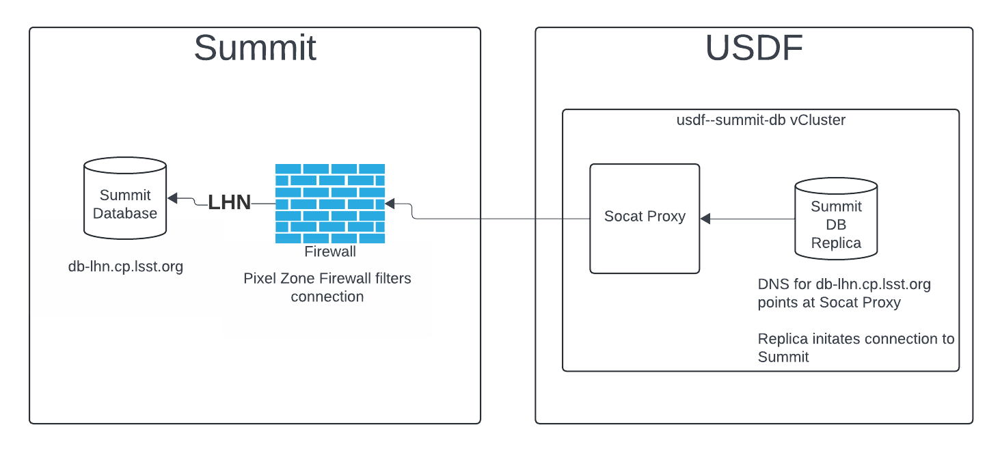

#######################
Application Information
#######################

Application Roles & Contacts
============================
.. Describe who is performing the application roles.  Detailed in about section.

.. list-table:: Application Roles
   :widths: 25 25
   :header-rows: 1

   * - Role
     - Person
   * - Application Sponsor
     -
   * - Application Owner
     -
   * - Database Administrator
     -
   * - Application Infrastructure
     -
   * - Operations Support
     -
   * - Documentation Lead
     -

Architecture
============
.. Describe the architecture of the application including key components (e.g API servers, databases, messaging components and their roles).  Describe relevant network configuration.

The database is named ``summit-db-logical-replica`` in the ``summit-db-logical-replica`` Kubernetes namespace.

Logical replication uses a publication and subscription model.  Both the publication and subscription summit database instances are deployed with the Cloud Native Postgres (CNPG) Operator.  The publication is configured at the Summit with a CNPG cluster name of cnpg in the cloudnativepg Kubernetes namespace.  Contact the ``devops-team`` Slack channel for assistance with the Summit database to update the publication or with troubleshooting.

No external connectivity is configured or needed for the database.  Logical replication traffic uses the LHN.  The DNS name is ``usdf-summitdb-replica.slac.stanford.edu``

Architecture Diagram
====================
.. Include architecture diagram of the application either as a mermaid chart or a picture of the diagram.

Associated Systems
==================
.. Describe other applications are associated with this applications.

Consolidated Database API, ExposureLog API, NarrativeLog API, and Nighreport API applications use the database as a data source for the APIs.

Configuration Location
======================
.. Detail where the configuration is stored.  This is typically in GitHub, Kubernetes Configuration Maps, and/or Vault Secrets.

The database cluster configuration is the GitHub repository.  SQL for the table structures are in the SQL folder in the overlay.

Data Flow
=========
.. Describe how data flows through the system including upstream and downstream services

Postgres replication is from the Summit to the USDF.  The Summit has the publications configured and the USDF has the subscriptions.  The subscriptions pull from the publication.

Dependencies - S3DF
===================
.. Dependencies at USDF include Ceph, Weka Storage, Butler Database, LDAP, other Rubin applications, etc..  This can be none.

Below are the S3DF Dependencies.
 * Kubernetes
 * SLAC LDAP to authenticate to vCluster
 * LHN connectivity to the Summit
 * DNS to resolution of cp.lsst.org domain to resolve the Summit database
 * Weka storage for Kubernetes.  The database uses a persistent volume claim.
 * S3 for backups and WAL archiving

Dependencies - External
=======================
.. Dependencies on systems external to S3DF including in US DAC, France or UK DF, or other external systems.  This can be none.

The external dependencies is the LHN connectivity to the Summit.

Disaster Recovery
=================
.. RTO/RPO expectations for application.
